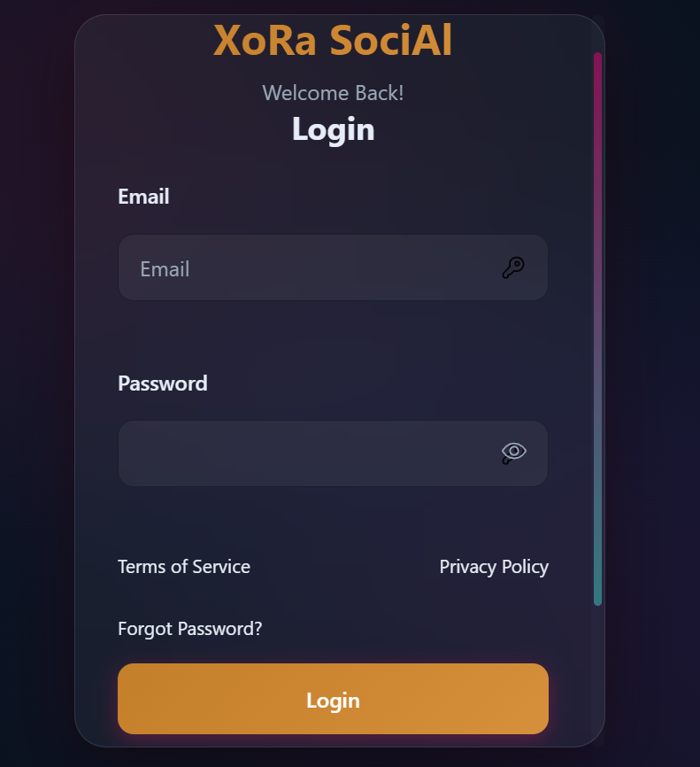
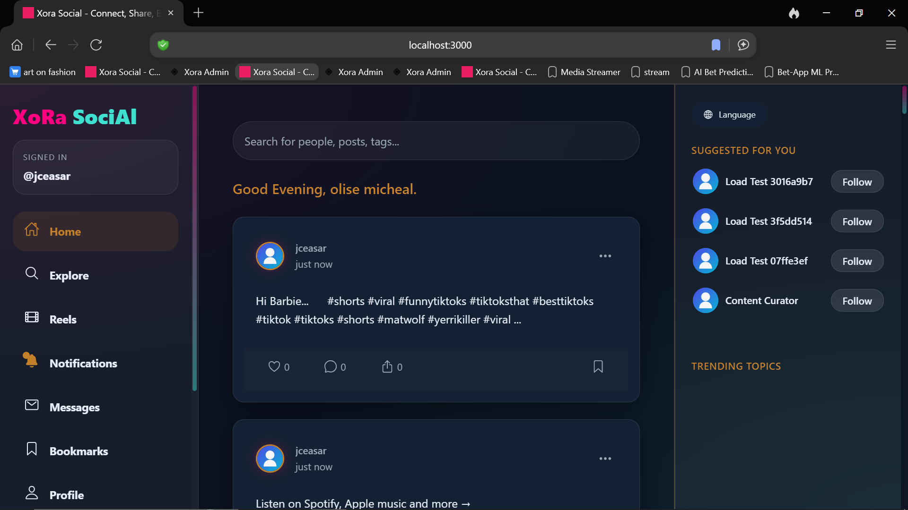
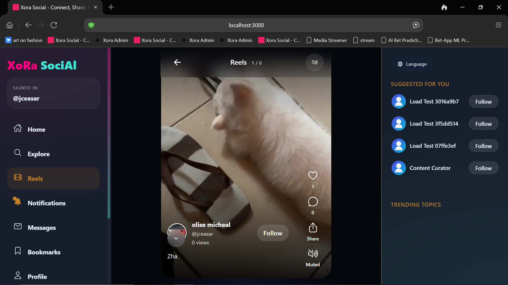
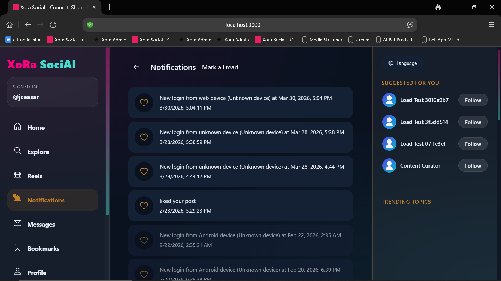
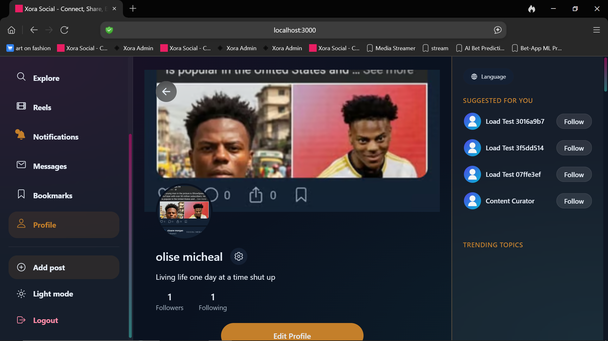
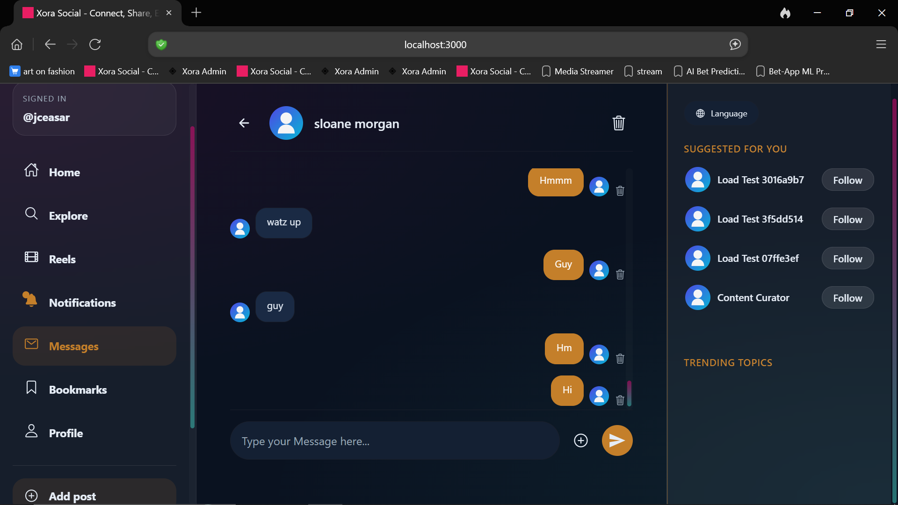
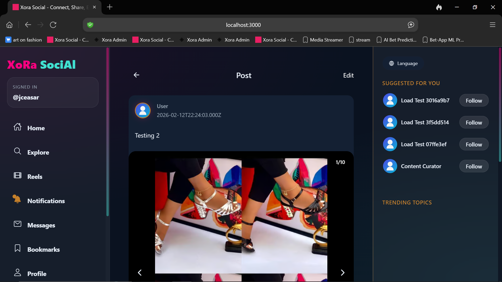
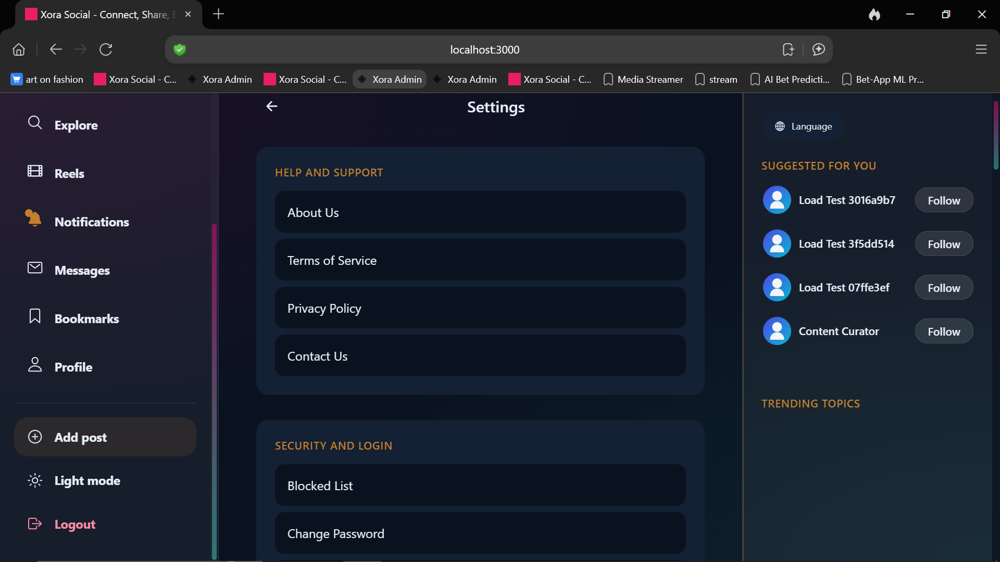

# Xora Web

Responsive web client for the Xora social platform.

## Overview

Xora Web brings the social experience to the browser with feed, reels, messaging, profile, page, and settings flows, while keeping a mobile-friendly shell and shared media rendering model.

## Highlights

- authenticated social feed and post detail experience
- reels browsing with shared image/video rendering
- responsive layout with mobile-style navigation on smaller screens
- settings, profile, pages, search, messaging, and notification flows
- Vite-based frontend with reusable context-driven state

## Stack

- React
- Vite
- React Router
- Context-based client state

## Local Development

```bash
npm install
npm run dev
```

Build for production:

```bash
npm run build
```

Main entry points:
- `src/main.jsx`
- `src/App.jsx`
- `src/services/api.js`

## Screenshots

### Home Feed


### Reels


### Post Detail


### Additional Views






## Structure

- `src/components/` - reusable UI building blocks
- `src/pages/` - route-level screens
- `src/contexts/` - auth, app data, websocket, and theme state
- `src/services/` - API and notifications integration
- `src/utils/` - parsing, validation, engagement, and PWA helpers

## Environment

Use `.env.example` as the template for local values.

## Repo Scope

This repository is the standalone web frontend for Xora.
